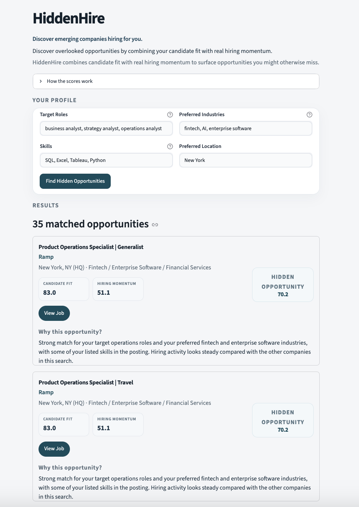

# HiddenHire

Discover emerging job opportunities through candidate fit and company hiring momentum.

## Overview

HiddenHire is an MVP hiring-signal discovery platform. It helps job seekers find roles at emerging and lesser-known companies, instead of limiting a search to well-known employers or keyword matches alone.

A candidate enters target roles, skills, industries, and a preferred location. HiddenHire ranks current openings by how well each role fits that profile and by how the company’s hiring is changing over time. Each result links back to the original posting.

## The Problem

Job seekers often apply to companies they already know. Openings at emerging companies are harder to notice, especially when hiring activity is spread across many career sites. HiddenHire brings those openings together and ranks them using fit and recent hiring activity.

## How HiddenHire Works

Candidate Profile → Job Data Collection → Candidate Fit → Hiring Momentum → Hidden Opportunity Score → Opportunity Explanation → Original Job Posting

1. The candidate describes target roles, skills, industries, and location.
2. Job snapshots are collected from public company career boards.
3. Each opening is scored for candidate fit.
4. Each company is scored for hiring momentum from historical snapshots.
5. Fit and momentum are combined into a Hidden Opportunity score.
6. A short explanation states which of those signals support the result.
7. The card links to the original job posting.

## Core Features

- Candidate-to-job matching against the latest job snapshot
- Candidate Fit scoring
- Company Hiring Momentum from prior snapshots
- Hidden Opportunity ranking
- “Why this opportunity?” explanations based on the calculated signals
- Direct links to original job postings
- Historical job snapshots stored by date
- Automated weekly job-data collection

## Data Pipeline

Public job posts are collected from company boards on Ashby, Greenhouse, and Lever. Each run stores that day’s openings in `HiddenHire_Data.xlsx` and keeps earlier snapshot dates.

A GitHub Actions workflow runs the collectors in sequence, recalculates hiring momentum, and commits the updated workbook. It is scheduled for Monday morning New York time and can also be started manually. The company master list is not updated by the workflow.

## Company Coverage

HiddenHire tracks a curated list rather than the whole job market. The list was assembled in September 2026 and contains 50 New York-based, venture-backed companies sourced from StartupsGallery, TopStartups, and Y Combinator's company directory. Most are Series A or B and have 11–500 employees, across AI, fintech, health tech, and enterprise software.

43 companies are collected each week: those hiring through Ashby, Greenhouse, or Lever. The other 7 are marked inactive in the `Active` column, 6 because they use job boards without a collector (Gem, Comeet, Dover). Together the active companies post about 1,200 open roles, and snapshots have been kept weekly since September 20, 2026.

## Data Quality Fixes

Problems found in the data and scoring, and how they were fixed:

- **Missing descriptions:** the Greenhouse collector stored no job descriptions, so more than a quarter of all postings scored 0 on skills. It now requests and cleans the full text. Lever postings now include their requirements bullets, not just the introduction.
- **One-day momentum window:** momentum compared the two most recent snapshots, which were one day apart when a manual run followed a scheduled one. It now uses the snapshot closest to seven days earlier.
- **Substring matching:** "Excel" matched "excellent" (519 postings contained "excel", 53 mentioned the skill), "AI" matched "Supply Chain", and "intern" matched "international". All matching is now whole-word.
- **Hard-coded relevance:** momentum always counted analyst roles, whatever the candidate searched for. It now uses the candidate's target roles.
- **Size bias:** momentum used raw job counts, so the largest employers ranked highest. Signals are now relative to company size.

Each fix has tests in `tests/`.

## Limitations

- **Coverage:** results only include the companies on the list. A strong opening elsewhere will not appear.
- **Short history:** momentum is built from weekly snapshots starting in late September 2026. With a few weeks of data, one new posting at a small company can move its score noticeably. Whether high momentum predicts continued hiring has not been tested yet.
- **Rule-based matching:** skills and roles are matched by keyword. Synonyms ("BI" vs. "business intelligence"), plurals, and roles outside the built-in role families are missed.
- **Seniority from titles:** experience level is inferred from job titles only. Requirements stated in the description, such as "3+ years", are not read.
- **Simple location matching:** locations are matched as text, and every remote posting gets partial credit regardless of region.
- **Storage:** snapshots live in one Excel workbook that is rewritten each week. It works at this scale but will slow down as history grows.
- **Hosting:** the free Streamlit tier puts the app to sleep after inactivity, so the first visit can take about 30 seconds to load.

## Scoring

Scores are rule-based. HiddenHire does not use an external language model.

**Candidate Fit** compares an opening with the profile:

- **Title (35%)**: 100 when the title contains a target role exactly, 75 for another title in the same role family.
- **Seniority (25%)**: the title is classified as entry, mid, or senior and scored against the experience level the candidate picks.
- **Skills (20%)**: the share of the candidate's skills found in the posting.
- **Industry (10%)**: full credit when the company is in any preferred industry.
- **Location (10%)**: full credit for the preferred location, partial credit for remote.

Skills, industries, roles, and seniority words match as whole words, so "Excel" does not match "excellent" and "intern" does not match "international". Results are limited to jobs in a target role family that meet the fit cutoff, leaving out titles two levels away from the chosen experience level.

**Hiring Momentum** is a company-level score. It compares the latest snapshot with the snapshot closest to seven days earlier: newly opened roles in the candidate's target role families (40%), the net change in those relevant roles (25%), the overall open-job growth rate (20%), and new postings overall (15%).

Each signal is measured relative to the company's size (its open jobs a week earlier, counted as at least 10), so five new roles at a 15-job startup outweigh five new roles at a 150-job company. Signals are scaled against the 90th percentile across companies, so one extreme company does not flatten everyone else. A company added to the list this week has no baseline yet and scores a neutral 50. Companies marked inactive are left out.

**Hidden Opportunity** ranks each job as 60% Candidate Fit and 40% Hiring Momentum.

The explanation under each result uses only signals those scores already support, such as role match, skills, industry, location, and whether hiring momentum is elevated, steady, or quieter.

## Tech Stack

- Python 3.11+
- Pandas
- Streamlit
- Excel workbooks via OpenPyXL
- Requests for public job-board APIs
- GitHub Actions for the weekly update
- pytest for the scoring tests

## Running the Tests

```bash
pip install -r requirements-dev.txt
pytest
```

## MVP Status

HiddenHire is an independently developed MVP and portfolio project. It is actively being developed.

## Live Demo

[Try HiddenHire Live](https://hiddenhire.streamlit.app/)

## Screenshot



## Future Development

- Market insights: which companies and job functions are growing or slowing week over week
- Check whether high-momentum companies keep hiring in the following weeks
- Highlight roles that newly appear between historical snapshots
- Collect from additional applicant-tracking systems
- Add international-student sponsorship signals

## Author

**Meng Han**  
M.S. Management and Analytics (Business Analytics), New York University
